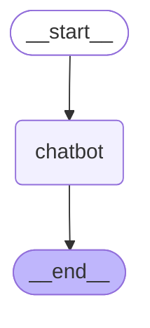
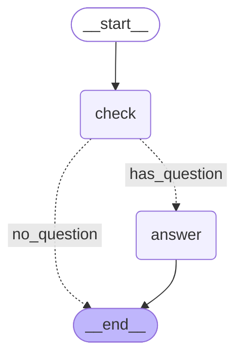
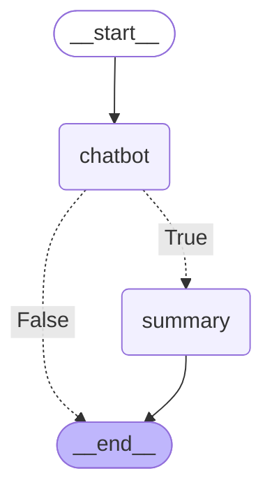

### 기본 그래프

```mermaid
graph TD;
        __start__([<p>__start__</p>]):::first
        chatbot(chatbot)
        __end__([<p>__end__</p>]):::last
        __start__ --> chatbot;
        chatbot --> __end__;
        classDef default fill:#f2f0ff,line-height:1.2
        classDef first fill-opacity:0
        classDef last fill:#bfb6fc
```

### 조건부 분기 그래프

```mermaid
graph TD;
        __start__([<p>__start__</p>]):::first
        check(check)
        answer(answer)
        __end__([<p>__end__</p>]):::last
        __start__ --> check;
        check -. &nbsp;no_question&nbsp; .-> __end__;
        check -. &nbsp;has_question&nbsp; .-> answer;
        answer --> __end__;
        classDef default fill:#f2f0ff,line-height:1.2
        classDef first fill-opacity:0
        classDef last fill:#bfb6fc
```

###  라우터- 조건부 분기 그래프

```mermaid
graph TD;
        __start__([<p>__start__</p>]):::first
        chatbot(chatbot)
        summary(summary)
        __end__([<p>__end__</p>]):::last
        __start__ --> chatbot;
        chatbot -. &nbsp;False&nbsp; .-> __end__;
        chatbot -. &nbsp;True&nbsp; .-> summary;
        summary --> __end__;
        classDef default fill:#f2f0ff,line-height:1.2
        classDef first fill-opacity:0
        classDef last fill:#bfb6fc
```